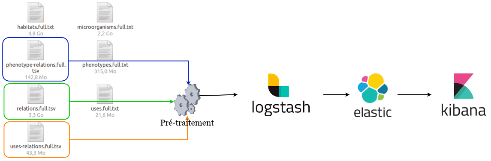

# beyond-es-indexation


#### Please, provide the data-examples folder with these files: 

```
-   taxon_habitats = "./data-examples/relations.full.tsv"
-   taxon_phenotypes = "./data-examples/phenotype-relations.full.tsv"
-   taxon_uses = "./data-examples/uses-relations.full.tsv"
```
#### Build the Jsonl file by calling :

```
beyond_relations_preprocess.ipynb
```
#### Index Data to ES using Logstash

```
sudo /usr/share/logstash/bin/logstash -f 'beyond_conf.conf' #manage to give the absolute path for the .conf
```

### NB : It's supposed that you have already installed ES and Logstash on your computer (or server). If not, check the guid below

#### ElasticSearch

```
https://www.elastic.co/guide/en/elasticsearch/reference/current/deb.html
```

#### kibana

```
https://www.elastic.co/guide/en/kibana/current/deb.html
```

#### START

```
sudo systemctl start elasticsearch.service #start lesaticserach
```

```
sudo systemctl start kibana.service #start kibana
```
